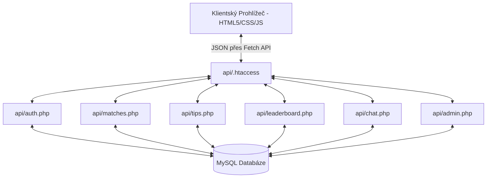

# 📖 Technická dokumentace – MS 2026 Tipovačka

Tento dokument slouží jako detailní vývojářská a administrátorská příručka pro projekt **MS 2026 Tipovačka**. Popisuje vnitřní architekturu, databázové schéma, specifikaci API rozhraní a bezpečnostní prvky.

---

## 🏛️ Celková architektura

Aplikace je navržena jako lehká, rychlá a snadno přenositelná. Neobsahuje žádné externí npm závislosti ani PHP balíčky.



*   **Frontend (SPA charakter):** Klientský kód komunikuje asynchronně přes `fetch()` s credentials. Veškeré překreslování dat se odehrává na straně klienta v **[app.js](file:///Users/matejhovorka/Library/Mobile%20Documents/com~apple~CloudDocs/Downloads%20-%20iCloud/%21vibecoding/wc/worldcup/app.js)**, což zajišťuje plynulý uživatelský zážitek bez neustálého obnovování stránek.
*   **Backend (Stateless REST-like API):** PHP soubory zpracovávají příchozí HTTP požadavky (`GET`/`POST`), provádějí autorizaci a vracejí standardizované JSON odpovědi. Společné funkce a inicializace databáze jsou sdíleny v **[api/config.php](file:///Users/matejhovorka/Library/Mobile%20Documents/com~apple~CloudDocs/Downloads%20-%20iCloud/%21vibecoding/wc/worldcup/api/config.php)**.

---

## 🗄️ Databázové schéma

Databáze se skládá ze 4 hlavních tabulek. Všechny tabulky používají úložiště **InnoDB** a kódování **utf8mb4** pro podporu speciálních znaků a emoji.

### 1. Tabulka `users` (Uživatelé)
Uchovává informace o registrovaných hráčích.
*   `id` (INT UNSIGNED, PK, AUTO_INCREMENT)
*   `name` (VARCHAR(100)) – Jméno/Přezdívka zobrazená v žebříčku a chatu.
*   `email` (VARCHAR(255), UNIQUE) – Přihlašovací e-mail.
*   `password_hash` (VARCHAR(255)) – Heslo zašifrované pomocí `bcrypt`.
*   `avatar_url` (VARCHAR(500), NULL) – Volitelný odkaz na externí avatar nebo barvu generovaného avataru.
*   `is_admin` (TINYINT(1)) – Příznak administrátora (0 = běžný uživatel, 1 = admin).
*   `created_at` (DATETIME) – Čas registrace.

### 2. Tabulka `matches` (Zápasy)
Obsahuje kompletní harmonogram turnaje.
*   `id` (INT UNSIGNED, PK) – ID zápasu odpovídající oficiálnímu číslování.
*   `group_letter` (CHAR(1)) – Písmeno skupiny (A–L) nebo fáze play-off (R = 1/16, O = 1/8, Q = čtvrtfinále, S = semifinále, 3 = o 3. místo, N = finále).
*   `home_team` (VARCHAR(100)) – Název domácího týmu (v angličtině, slouží i k napárování vlajky).
*   `away_team` (VARCHAR(100)) – Název hostujícího týmu.
*   `match_date` (DATE) – Datum výkopu v UTC.
*   `time_cest` (TIME) – Čas výkopu v UTC.
*   `venue` (VARCHAR(200)) – Název stadionu.
*   `city` (VARCHAR(100)) – Město konání.
*   `result_home` (TINYINT UNSIGNED, NULL) – Skutečné góly domácích (vyplňuje admin).
*   `result_away` (TINYINT UNSIGNED, NULL) – Skutečné góly hostů (vyplňuje admin).
*   `status` (ENUM('NS', 'LIVE', 'FT')) – Stav zápasu (NS = Nezačalo, LIVE = Probíhá, FT = Skončilo).

### 3. Tabulka `tips` (Uživatelské tipy)
Uchovává tipy uživatelů na jednotlivé zápasy.
*   `id` (INT UNSIGNED, PK, AUTO_INCREMENT)
*   `user_id` (INT UNSIGNED, FK -> `users.id`)
*   `match_id` (INT UNSIGNED, FK -> `matches.id`)
*   `home_score` (TINYINT UNSIGNED) – Tipovaný počet gólů domácích.
*   `away_score` (TINYINT UNSIGNED) – Tipovaný počet gólů hostů.
*   `created_at` / `updated_at` (DATETIME) – Časové značky.
*   *Unikátní index:* `UNIQUE KEY uq_user_match (user_id, match_id)` zamezuje duplicitním tipům od jednoho uživatele na stejný zápas.

### 4. Tabulka `chat_messages` (Zprávy v chatu)
Ukládá zprávy z hecovacího chatu. Je automaticky generována při prvním volání chatovacího API.
*   `id` (INT UNSIGNED, PK, AUTO_INCREMENT)
*   `user_id` (INT UNSIGNED, FK -> `users.id`)
*   `message` (VARCHAR(500)) – Text zprávy.
*   `created_at` (DATETIME) – Čas odeslání zprávy v UTC.

---

## 🧮 Bodovací algoritmus a výpočet pořadí

Výpočet bodů v žebříčku hráčů probíhá **zcela dynamicky v databázi** při každém požadavku na **[api/leaderboard.php](file:///Users/matejhovorka/Library/Mobile%20Documents/com~apple~CloudDocs/Downloads%20-%20iCloud/%21vibecoding/wc/worldcup/api/leaderboard.php)**. Tím je zajištěno, že se body nikdy nerozejdou a odpadá nutnost spouštět crony nebo ukládat redundantní data.

### SQL Logika bodování:
```sql
CASE
    -- Zápas musí být ve stavu FT (skončen) a uživatel musí mít uložený tip
    WHEN m.status = 'FT' AND t.home_score IS NOT NULL THEN
        CASE
            -- 1. Přesný výsledek (100 bodů)
            WHEN t.home_score = m.result_home AND t.away_score = m.result_away THEN 100
            
            -- 2. Správný brankový rozdíl nebo remíza (50 bodů)
            WHEN (CAST(t.home_score AS SIGNED) - CAST(t.away_score AS SIGNED)) = 
                 (CAST(m.result_home AS SIGNED) - CAST(m.result_away AS SIGNED)) THEN 50
                 
            -- 3. Správný vítěz bez rozdílu skóre (20 bodů)
            WHEN SIGN(CAST(t.home_score AS SIGNED) - CAST(t.away_score AS SIGNED)) = 
                 SIGN(CAST(m.result_home AS SIGNED) - CAST(m.result_away AS SIGNED)) THEN 20
                 
            ELSE 0
        END
    ELSE 0
END
```

---

## 🔌 API Referenční příručka

Všechny API endpointy vracejí odpověď s HTTP kódem 200, případně 4xx/5xx v závislosti na úspěchu operace, a hlavičkou `Content-Type: application/json`. Každá odpověď obsahuje atribut `version` (např. `'1.2'`).

### 🔑 Autentizace (`api/auth.php`)

*   **Získání aktuálního uživatele:**
    *   **Metoda:** `GET ?action=me`
    *   **Odpověď (Přihlášen):** `{ "user": { "id": 1, "name": "Matěj", "email": "matej@email.cz", "avatar_url": null, "is_admin": 1 } }`
    *   **Odpověď (Nepřihlášen):** `{ "user": null }`
*   **Registrace:**
    *   **Metoda:** `POST ?action=register`
    *   **Payload:** `{ "name": "Přezdívka", "email": "jmeno@email.cz", "password": "tajneheslo123" }`
    *   **Validace:** Jméno 2–50 znaků, platný e-mail, heslo min. 6 znaků.
*   **Přihlášení:**
    *   **Metoda:** `POST ?action=login`
    *   **Payload:** `{ "email": "jmeno@email.cz", "password": "tajneheslo123" }`
*   **Odhlášení:**
    *   **Metoda:** `POST ?action=logout`
*   **Aktualizace profilu:**
    *   **Metoda:** `POST ?action=update_profile`
    *   **Payload:** `{ "name": "Nové Jméno", "avatar_url": "https://url-obrazku.cz/avatar.png" }`

---

### ⚽ Zápasy (`api/matches.php`)

*   **Získání seznamu zápasů s tipy aktuálního uživatele:**
    *   **Metoda:** `GET`
    *   **Odpověď:** Vrátí seznam všech zápasů. Pokud je uživatel přihlášen, u každého zápasu je přibalen jeho tip (`tip_home`, `tip_away`) a příznak zamčení tipu `tips_locked`.
    *   **Příklad položky:**
        ```json
        {
          "id": 1,
          "group": "A",
          "home_team": "Mexico",
          "away_team": "South Africa",
          "date": "2026-06-11",
          "time": "17:00:00",
          "formatted_date": "čtvrtek 11. června, 19:00",
          "venue": "Mexico City Stadium",
          "city": "Mexico City",
          "result_home": null,
          "result_away": null,
          "status": "NS",
          "tip_home": 2,
          "tip_away": 1,
          "tips_locked": false
        }
        ```
    *   *Poznámka:* Časy zápasů jsou v DB uloženy v UTC, ale API je při výstupu automaticky převádí do lokálního středoevropského času (`Europe/Prague`), který se zobrazuje uživatelům.

---

### ✍️ Tipy (`api/tips.php`)

*   **Získání tipů přihlášeného uživatele:**
    *   **Metoda:** `GET`
*   **Uložení / Aktualizace tipu:**
    *   **Metoda:** `POST`
    *   **Payload:** `{ "match_id": 1, "home_score": 2, "away_score": 1 }`
    *   **Pravidla:** Tip lze uložit/změnit pouze v případě, že zápas ještě neskončil (`FT`), nezačal (`LIVE`) a do výkopu zbývá více než nastavený počet minut (např. 30 minut).

---

### 🏆 Žebříček (`api/leaderboard.php`)

*   **Načtení pořadí:**
    *   **Metoda:** `GET`
    *   **Odpověď:** `{ "leaderboard": [ { "id": 1, "name": "Matěj", "email": "...", "avatar_url": "...", "points": 150, "tips_count": 3 } ] }`

---

### 💬 Hecovací chat (`api/chat.php`)

*   **Načtení zpráv (posledních 50):**
    *   **Metoda:** `GET`
    *   **Odpověď:** Vrátí zprávy seřazené od nejstarších po nejnovější (vhodné pro přímé renderování dolů).
*   **Odeslání zprávy:**
    *   **Metoda:** `POST`
    *   **Payload:** `{ "message": "Text zprávy..." }` (max. 500 znaků).

---

### 🛠️ Administrace (`api/admin.php`)

Všechny endpointy v tomto souboru vyžadují přihlášeného uživatele s příznakem `is_admin = 1`.

*   **Získání seznamu zápasů pro administraci:**
    *   **Metoda:** `GET`
*   **Uložení výsledku zápasu:**
    *   **Metoda:** `POST ?action=result`
    *   **Payload:** `{ "match_id": 1, "result_home": 3, "result_away": 2, "status": "FT" }`
    *   *Poznámka:* Uložením výsledku a nastavením stavu `FT` dojde k okamžitému přepočítání žebříčku při příštím načtení.
*   **Změna stavu zápasu (např. na LIVE):**
    *   **Metoda:** `POST ?action=setstatus`
    *   **Payload:** `{ "match_id": 1, "status": "LIVE" }`
*   **Změna data a času výkopu:**
    *   **Metoda:** `POST ?action=updatetime`
    *   **Payload:** `{ "match_id": 1, "match_date": "2026-06-11", "time_cest": "19:00" }`
    *   *Poznámka:* Čas se zadává v lokálním čase `Europe/Prague` a PHP jej před uložením do DB převede na UTC.

---

## 🔒 Bezpečnostní opatření

1.  **Šifrování hesel:** Používá se standardní PHP `password_hash($pass, PASSWORD_BCRYPT)`, což zaručuje bezpečné uložení hesel odolné proti útoku hrubou silou.
2.  **Ochrana Session:** Cookies relací jsou nastaveny s parametry `HttpOnly` (obrana proti XSS) a `SameSite=Lax`. Pokud web běží na HTTPS, automaticky se zapne příznak `Secure`.
3.  **CORS & CSRF Ochrana:**
    *   Backend kontroluje původ požadavků (`HTTP_ORIGIN` a `HTTP_REFERER`).
    *   Povoleny jsou pouze požadavky ze stejné domény, `localhost`, `127.0.0.1` a domén s koncovkou `.local`.
    *   U POST požadavků se striktně ověřuje validní původ, aby se předešlo Cross-Site Request Forgery (CSRF).
4.  **Ošetření vstupů:** Všechny textové vstupy (jména uživatelů, zprávy v chatu) jsou při zápisu či výstupu čištěny pomocí `strip_tags()` a na frontendu bezpečně escapovány pomocí pomocné funkce `escapeHtml()`, aby se zabránilo HTML/JS injekci (XSS).

---

## ⚙️ Deployment na produkční server

Při převodu z lokálního prostředí na ostrý hosting (např. Wedos, Active24, cPanel, Plesk):
1.  Ujistěte se, že databáze běží na MySQL 5.7+ nebo MariaDB 10.3+.
2.  Zkontrolujte verzi PHP (doporučena verze **PHP 8.1 nebo novější**).
3.  V souboru `api/config.php` změňte `DB_HOST`, `DB_NAME`, `DB_USER` a `DB_PASS`.
4.  Pokud se vám po přihlášení nenačítají data a konzole hlásí chybu CORS, zkontrolujte, zda doména, na které aplikace běží, odpovídá podmínkám ve funkci `getAllowedOrigin()` v `api/config.php`.
5.  Ujistěte se, že server správně zpracovává soubory `.htaccess` (modul `mod_rewrite` v Apache musí být povolen). Pokud používáte Nginx, budete muset pravidla přepsat do konfigurace Nginx serveru blocku:

```nginx
# Příklad Nginx konfigurace pro hezké URL adresy
location / {
    try_files $uri $uri/ $uri.html =404;
}

location /api/ {
    try_files $uri $uri/ /api/index.php?$query_string;
}
```
